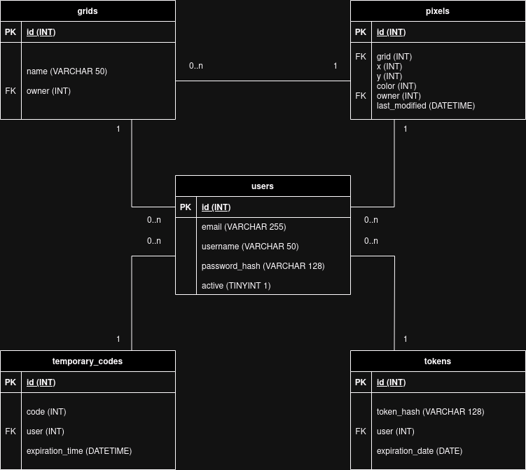

# r/place

Ce projet, réalisé dans le cadre d’un cours de base de données et développement Web, est une réplique simplifiée du jeu Reddit [r/place](https://www.reddit.com/r/place/).

## Mise en route

* Importez le fichier `database.sql` en tant que nouvelle base de données MySQL. (la base de données est vide de tout contenu, le contenu sera créé au gré de vos essais)
* Créez un fichier `secrets.php` à la racine, sur le modèle de `secrets.php.example`.
* Spécifiez-y les paramètres et identifiants du serveur SMTP que vous souhaitez utiliser pour l'envoi des mails.
* Mettez à jour les identifiants de connexion à la base de données dans `include/config.inc.php`.
* Mettez le tout à disposition de votre serveur PHP&nbsp;! (les tests ont été effectués sous un environnement XAMPP)

## Modèle de la base de données

[Accéder au fichier XML draw.io](./r-place.drawio.xml)

users(**id**, email, username, password_hash, active)  
temporary_codes(**id**, code, #user, expiration_time)  
tokens(**id**, token_hash, #user, expiration_date)  
grids(**id**, name, #owner)  
pixels(**id**, #grid, x, y, color, #owner, last_modified)
